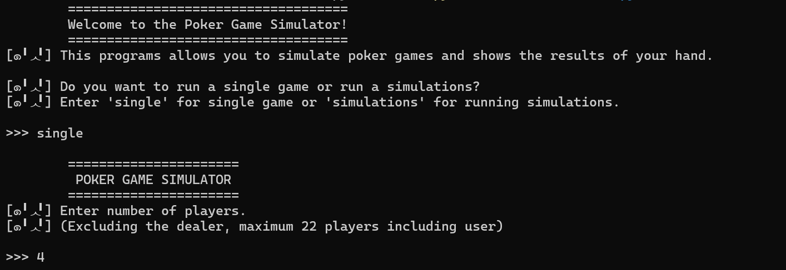
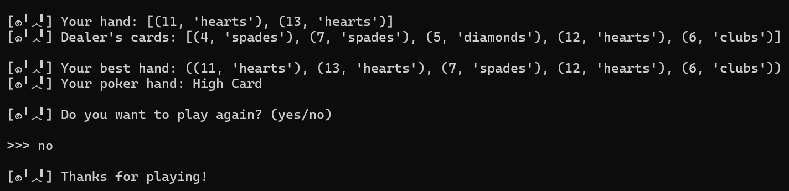
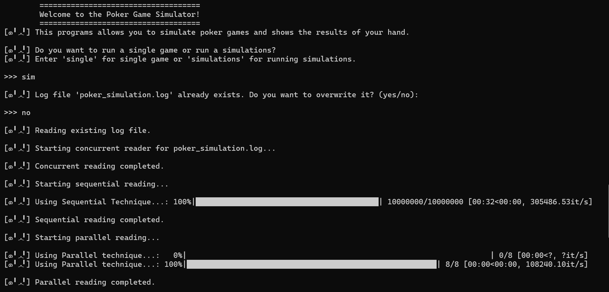
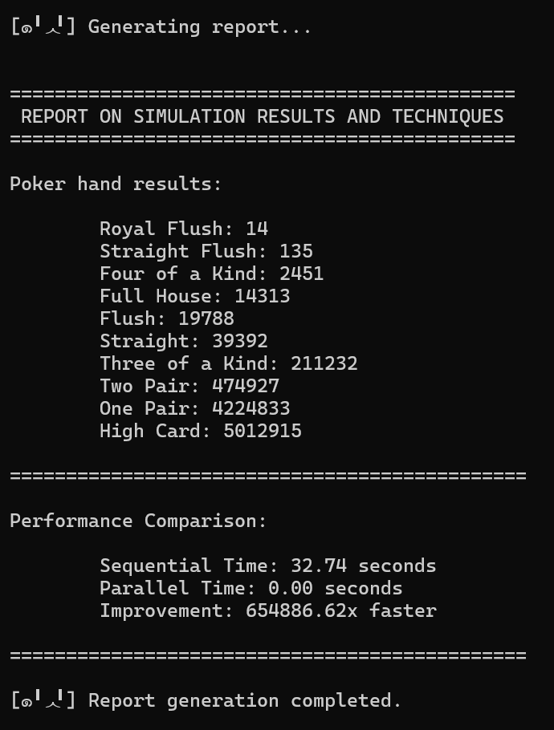

# Poker Game Simulator

**Name:** ARIF AZIZAN BIN ARIFIN  
**Student ID:** 2024206174  
**Group :** M3CS2554A  
**Course Code:** ITT440  
**Lecturer:** Shahadan Bin Saad  
**YouTube Demo:** [*Code Review and Demonstration Video*](https://youtu.be/rw1csBi419k)

## Overview

The Poker Game Simulator is a Python-based application designed to simulate poker games, evaluate poker hands, and compare execution performance using sequential and parallel processing techniques. This project combines game logic with performance analysis.

## Problem Statement

The analysis of poker hand probabilities requires running a large number of game simulations to obtain accurate and meaningful results. However, different processing techniques may affect how efficiently these simulations are executed. Therefore, this project focuses on developing a poker game simulator capable of running up to 10,000,000 simulations and analyzing the results using two techniques, sequential and parallel processing. The purpose is to compare the performance of both approaches in handling large scale simulations and to observe their differences in execution.

## Objective

The main objectives of the Poker Game Simulator are:

- Build a valid poker hand evaluator that ranks hands from High Card to Royal Flush.
- Simulate single games and multiple game runs with random shuffled decks.
- Save simulation results to a log file for later analysis.
- Compare sequential and parallel processing methods.
- Generate a clear report of hand frequencies and processing performance.

## Program Capabilities

The simulator supports:

- Interactive single game play.
- Multiple game simulations with log output.
- Automatic dealing of player and dealer cards.
- Best 5-card hand selection from 7 available cards.
- Hand ranking for all standard poker combinations.
- Log file analysis with threading.
- Performance comparison using multiprocessing.

## Techniques Used

- `random.shuffle` for deck randomization.
- `itertools.combinations` to evaluate all 5-card hand combinations from available cards.
- `os` for checking existance of log files.
- `collections.Counter` for rank counting and frequency analysis.
- `threading` for concurrent log reading.
- `multiprocessing` for parallel analysis across CPU cores.
- `time.perf_counter` for performance timing.
- `tqdm` for progress bars during data processing.

## System Requirements

- Operating System: Windows 10/11, macOS, or Linux
- Python 3.10 or newer
- At least 4 GB RAM recommended for simulation and multiprocessing
- Internet access for downloading Python and packages

## Required Python Package

- `random`
- `itertools`
- `collections`
- `os`
- `threading`
- `multiprocessing`
- `time`
- `tqdm`

## Installation Steps

1. Install Python 3.10+ from https://www.python.org/downloads/
2. Open a terminal or PowerShell window.
3. Navigate to the project folder (use directory where the program is located):

```powershell
cd "C:\Users\(Username)\Downloads"
```

4. Install the required package:

```powershell
pip install random
```
```powershell
pip install itertools
```
```powershell
pip install collections
```
```powershell
pip install os
```
```powershell
pip install threading
```
```powershell
pip install multiprocessing
```
```powershell
pip install time
```
```powershell
pip install tqdm
```

5. Confirm the main script is present:

- `Poker Simulator.py`
- `poker_simulation.log` (created after the first simulation)

## How to Run the Program

Run the main script using Python:

```powershell
python "Poker Simulator.py"
```

The program will prompt you to choose between:

- `single` — play one game interactively
- `simulations` — run multiple game simulations and analyze results

### Single Game Mode

1. Choose `single` when prompted.
2. Enter the number of players (between 2 and 22).
3. The program deals cards and displays:
   - Your hand
   - Dealer cards
   - Best 5-card hand
   - Poker hand ranking
4. After each game, it asks whether you want to play again.

### Simulations Mode

1. Choose `simulations` when prompted.
2. If `poker_simulation.log` exists, the program asks whether to overwrite it.
3. Enter the number of simulations to run.
4. Enter the number of players (including the user).
5. The program writes results to `poker_simulation.log`.
6. It reads the log file using threading, then analyzes it sequentially and in parallel.
7. Finally, it prints a report comparing execution times and hand frequencies.

## Sample Input / Output

### Sample Input

```text
        ====================================
        Welcome to the Poker Game Simulator!
        ====================================
[๑╹ᆺ╹] This programs allows you to simulate poker games and shows the results of your hand.

[๑╹ᆺ╹] Do you want to run a single game or run a simulations?
[๑╹ᆺ╹] Enter 'single' for single game or 'simulations' for running simulations.

>>> single

        ======================
         POKER GAME SIMULATOR 
        ======================
[๑╹ᆺ╹] Enter number of players.
[๑╹ᆺ╹] (Excluding the dealer, maximum 22 players including user)

>>> 5
```

### Sample Output

```text
[๑╹ᆺ╹] Your hand: [(11, 'hearts'), (3, 'spades')]
[๑╹ᆺ╹] Dealer's cards: [(4, 'clubs'), (5, 'hearts'), (6, 'diamonds'), (7, 'spades'), (9, 'clubs')]

[๑╹ᆺ╹] Your best hand: [(3, 'spades'), (4, 'clubs'), (5, 'hearts'), (6, 'diamonds'), (7, 'spades')]
[๑╹ᆺ╹] Your poker hand: Straight
```

### Sample Simulation Output

```text
Completed 10000000 simulations. Results saved to poker_simulation.log.

[๑╹ᆺ╹] Starting concurrent reader for poker_simulation.log...

[๑╹ᆺ╹] Concurrent reading completed.

[๑╹ᆺ╹] Starting sequential reading...

[๑╹ᆺ╹] Using Sequential Technique...: 100%|██████████████████████████████████████████████| 10000000/10000000 [00:33<00:00, 302944.26it/s]

[๑╹ᆺ╹] Sequential reading completed.

[๑╹ᆺ╹] Starting parallel reading...

[๑╹ᆺ╹] Using Parallel technique...: 100%|██████████████████████████████████████████████████████████████| 8/8 [00:00<00:00, 96144.50it/s]

[๑╹ᆺ╹] Parallel reading completed.

[๑╹ᆺ╹] Generating report...

=============================================
 REPORT ON SIMULATION RESULTS AND TECHNIQUES 
=============================================

Poker hand results:

	Royal Flush: 14
	Straight Flush: 135
	Four of a Kind: 2451
	Full House: 14313
	Flush: 19788
	Straight: 39392
	Three of a Kind: 211232
	Two Pair: 474927
	One Pair: 4224833
	High Card: 5012915

=============================================

Performance Comparison:

	Sequential Time: 33.02 seconds
	Parallel Time: 0.00 seconds
	Improvement: 436142.52x faster

=============================================

[๑╹ᆺ╹] Report generation completed.
```

## Screenshots

Single Game Input  


Single Game Output  


Simulation Run  


Performance Report  


## Source Code

The main program source file is:

- `Poker Simulator.py`

Important code sections:

- `pokerGame` class — deck creation, dealing, hand evaluation, and best-hand selection
- `runPokerSimulations()` — generates simulation results and writes to the log file
- `concurrentReader()` — reads log content using a separate thread
- `sequentialTech()` and `parallelTech()` — compare sequential and parallel log analysis
- `reportResult()` — prints summary counts and performance comparison

## Conclusion

The Poker Game Simulator demonstrates how game logic, hand evaluation, and performance analysis can be combined in a single Python project. By supporting interactive play and large-scale simulations, it offers a practical example of both software design and computational optimization. The project also shows the value of comparing sequential, concurrent, and parallel techniques when processing real simulation data. In the simulation analysis, the parallel processing technique performs better than the sequential approach, highlighting the advantage of using multiple CPU cores for log analysis workloads.

## Notes

- Ensure all module is installed before running the script.
- The simulator writes output to `poker_simulation.log` in the same folder.
- For better performance benchmarking, use at least 1,000,000 simulations.
