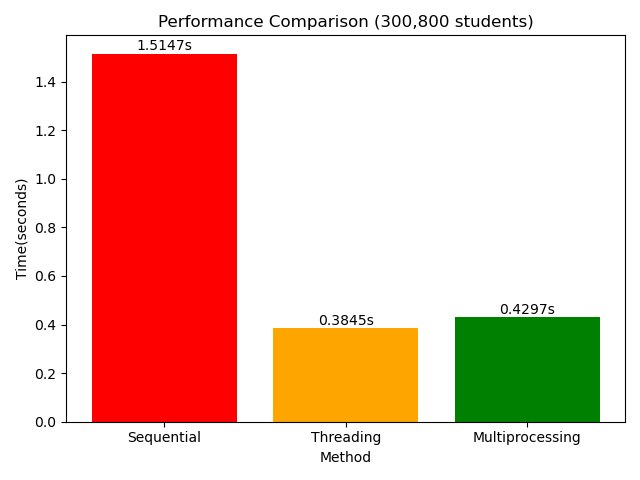

# 📊 Parallel Student Attendance Counter

## 📌 Overview
This project demonstrates the comparison between **three programming techniques**:
- Sequential
- Concurrent (Threading)
- Parallel (Multiprocessing)

The system processes a large dataset of student attendance (over 300,000 records) and measures execution time for each technique.

---

## 🎯 Objectives
- To understand differences between sequential, concurrent, and parallel programming  
- To implement all three techniques using Python  
- To analyze performance when handling large-scale data  
- To visualize execution time using a graph  

---

## ⚙️ Techniques Explanation

### 1. Sequential Processing
Sequential processing executes tasks **one by one** using a single flow.

✔ Processes all data one by one 

❌ No concurrency or parallelism 

❌ Simple but slower for large data 

---

### 2. Concurrent Processing (Threading)
Threading allows multiple tasks to run **at the same time (logically)**.

✔ Splits data into parts 

✔ Suitable for I/O-based tasks 

✔ Uses multiple threads to process simultaneously

---

### 3. Parallel Processing (Multiprocessing)
Multiprocessing uses **multiple CPU cores** to run tasks simultaneously.

✔ Uses multiple CPU cores

✔ Processes data in parallel

✔ Best for heavy workloads

---

## 📥 Input Used

```
Present: 276500 
Absent: 24300 
```

---

## 📤 Output Result

```
Total Students: 300800
Processing... please wait.

Sequential Time: 1.5147 seconds
Threading Time: 0.3845 seconds
Multiprocessing Time: 0.4297 seconds

--- Results ---
Present : 276500
Absent : 24300

Fastest method: Threading
```

---

## 📈 Performance Analysis

- Sequential is slower because it processes data one by one  
- Threading is faster because it runs tasks concurrently  
- Multiprocessing is slightly slower than threading in this case due to process overhead  

👉 Therefore, **Threading is the fastest method for this dataset**

---

## 📈 Graph Visualization

The system generates a bar chart to compare execution time between:
- Sequential  
- Threading  
- Multiprocessing  

📌  *Graph image is shown below.*



---

## 🧾 Conclusion

This project shows that different programming techniques have different performance depending on the workload.

For this dataset, Threading performed the best, proving that concurrent programming can significantly improve performance in certain scenarios.

---

## 🎥 Demonstration Video

👉 YouTube link here:  
[Click to watch presentation](https://youtu.be/HryhGYRM0T0)

---

## 💻 Source Code (Click to Expand)

<details>
<summary>👉 Click here to view full code</summary>

```python
import time
import threading
from multiprocessing import Pool
import matplotlib.pyplot as plt

# =========================
# GENERATE DATA (MANUAL INPUT)
# =========================
def generate_attendance(present_count, absent_count):
    return ["Present"] * present_count + ["Absent"] * absent_count

# =========================
# SIMULATED PROCESSING DELAY
# =========================
DELAY_PER_RECORD = 0.000005  # Simulates real processing time per record

def heavy_count(sub_data):
    """Simulate realistic processing time proportional to data size."""
    time.sleep(len(sub_data) * DELAY_PER_RECORD)
    present = sub_data.count("Present")
    absent = sub_data.count("Absent")
    return present, absent

# =========================
# SEQUENTIAL
# =========================
def count_sequential(data):
    return heavy_count(data)

# =========================
# THREADING (CONCURRENT)
# =========================
def count_threading(data, num_threads=4):
    threads = []
    results = [None] * num_threads
    chunk_size = len(data) // num_threads

    def worker(i, sub_data):
        results[i] = heavy_count(sub_data)

    for i in range(num_threads):
        start = i * chunk_size
        end = (i + 1) * chunk_size if i != num_threads - 1 else len(data)
        t = threading.Thread(target=worker, args=(i, data[start:end]))
        threads.append(t)
        t.start()
    for t in threads:
        t.join()

    total_present = sum(r[0] for r in results)
    total_absent = sum(r[1] for r in results)
    return total_present, total_absent

# =========================
# MULTIPROCESSING (PARALLEL)
# =========================
def count_part(sub_data):
    import time
    time.sleep(len(sub_data) * 0.000005)
    return sub_data.count("Present"), sub_data.count("Absent")

def count_multiprocessing(data, num_processes=4):
    chunk_size = len(data) // num_processes
    chunks = []
    for i in range(num_processes):
        start = i * chunk_size
        end = (i + 1) * chunk_size if i != num_processes - 1 else len(data)
        chunks.append(data[start:end])

    with Pool(processes=num_processes) as pool:
        results = pool.map(count_part, chunks)

    total_present = sum(r[0] for r in results)
    total_absent = sum(r[1] for r in results)
    return total_present, total_absent

# =========================
# MAIN PROGRAM
# =========================
if __name__ == "__main__":
    print("=== Student Attendance System ===")

    # INPUT
    present_count = int(input("Enter number of Present students: "))
    absent_count = int(input("Enter number of Absent students: "))

    # GENERATE DATA
    data = generate_attendance(present_count, absent_count)
    print("\nTotal Students:", len(data))
    print("Processing... please wait.\n")

    # SEQUENTIAL
    start = time.time()
    p, a = count_sequential(data)
    seq_time = time.time() - start
    print(f"Sequential      Time: {seq_time:.4f} seconds")

    # THREADING
    start = time.time()
    p, a = count_threading(data)
    thread_time = time.time() - start
    print(f"Threading       Time: {thread_time:.4f} seconds")

    # MULTIPROCESSING
    start = time.time()
    p, a = count_multiprocessing(data)
    process_time = time.time() - start
    print(f"Multiprocessing Time: {process_time:.4f} seconds")

    # FINAL RESULT
    print("\n--- Results ---")
    print(f"Present : {p}")
    print(f"Absent  : {a}")

    fastest = min([("Sequential", seq_time), ("Threading", thread_time), ("Multiprocessing", process_time)], key=lambda x: x[1])
    print(f"\nFastest method: {fastest[0]}")

    # =========================
    # GRAPH
    # =========================
    methods = ["Sequential", "Threading", "Multiprocessing"]
    times = [seq_time, thread_time, process_time]
    colors = ["red", "orange", "green"]

    bars = plt.bar(methods, times, color=colors)
    for bar, t in zip(bars, times):
        plt.text(bar.get_x() + bar.get_width() / 2, bar.get_height() + 0.001,
                 f"{t:.4f}s", ha="center", va="bottom", fontsize=10)

    plt.xlabel("Method")
    plt.ylabel("Time (seconds)")
    plt.title(f"Performance Comparison ({len(data):,} students)")
    plt.tight_layout()
    plt.show()
```
