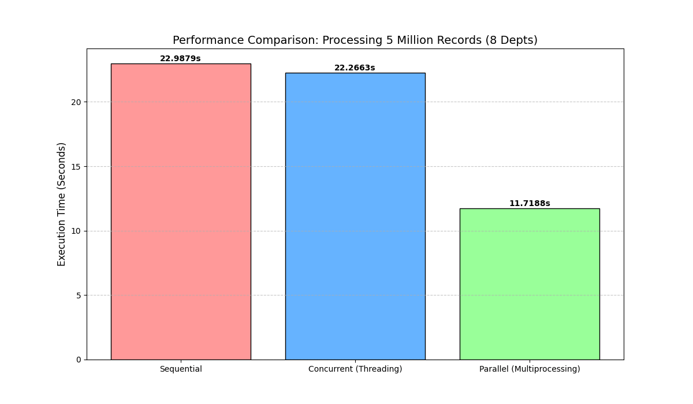

# Parallel Workforce Payroll Engine

* **Name:** Nurul Nabilah Binti Hisham
* **Student ID:** 2024290614
* **Course Code:** ITT440 (Network Programming)
* **Group:** M3CS2554B
* **GitHub Link:** https://github.com/Nabilah1105/Parallel_Workforce_Payroll_Engine
* **YouTube Demo:** https://youtu.be/Wb91M4Fy3h4


### 1. Introduction
The Parallel Workforce Payroll Engine is a high-performance Python application designed to process large-scale payroll data. In a real-world scenario, processing millions of employee records sequentially can be extremely slow. This project demonstrates how we can use Parallel Programming to split 5 million records into 8 different departments and process them simultaneously to save time.

### 2. Tools and Environment
- **Programming Language:** Python 3.12

- **Libraries:** Pandas, NumPy, Matplotlib

- **IDE:** Visual Studio Code (VS Code)

- **Hardware:** 16-Core CPU (Optimized for 8-department parallel processing)

### 3. How to Run
**To execute this project on your local machine, follow these steps:-**

1. **Download** the `payroll_engine3.py` file from this repository.
2. **Install** the required Python libraries using the terminal:
   ```bash
   pip install pandas numpy matplotlib
   ```
3. **Run the script:**
   ```bash
   python payroll_engine3.py
   ```
4. The system will automatically generate 5 million records and display the performance comparison graph. 

### 4. Dataset Information
The dataset for this project consists of 5 million records. Due to the large file size (~113MB), it is not uploaded directly to this GitHub repository. However, the system is designed to automatically generate the dataset file (payroll_data.csv) upon the first execution of the Python script.

### 5. System Implementation Logic
- **Sequential:** Processes all records one by one using a single CPU core.

- **Concurrent (Threading):** Uses Python threads to manage tasks (Limited by GIL).

- **Parallel (Multiprocessing):** Divides the dataset into 8 chunks (8 departments) and assigns them to 8 separate CPU processes for true simultaneous execution.

### 6. Performance Analysis
**Based on the testing:-**

- **Sequential Time:** ~22.98s

- **Concurrent Time:** ~22.26s

- **Parallel Time:** ~11.71s

By using 8 processes, we successfully reduced the processing time by nearly 46% compared to the sequential method.

### 7. Conclusion
This project proves that for CPU-bound tasks like payroll calculation, Parallel Programming (Multiprocessing) is much more efficient than traditional sequential methods, especially when dealing with Big Data.
